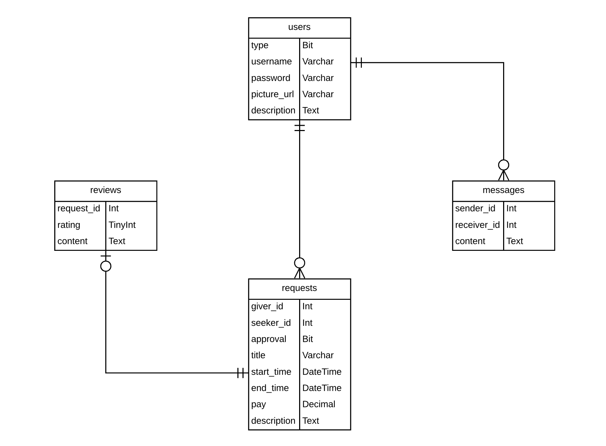

# I'm Here

## Entity Relationship Diagram

## Description
I'm Here is a web application connecting those who seek a service (assembling furniture, mounting wall fixtures, etc...) with those who wish to give assistance; we aptly refer to these amazing individulas as Givers and Seekers. I'm Here is a web based application providing a platform for Givers and Seekers to connect across a wide array of rendered services. One could seek help with everything from mounting a televison, to finding an interior designer, hiring an artist or even a street performer to entertain your guests at event. Oh, we can help you plan the event too. ImHere is here for you! 

## Technologies Used
Developmental mvp frameworks include JavaScript, React, Node.js, Express, Sql, and CSS. Post mvp features will include live chat for for users, and also provide them the opportunity to leave reviews. 

## Installation Instructions
TBD

## Wireframe
TBD

## User Stories
Below are some of the anticipated User Stories of our targeted demographics.

*User Story 1* As a single 30 something year old woman living in the city, I want to hire some help from time to time so I can complete jobs in my home or office.  Recently I had trouble assembling a dresser and really could have used some help. I would have greatly benefited from an application like I'm Here to lend me a hand. 

*User Story 2* As a parent living in Manhattan, NY I sometimes fall behind schedule and could use help with small tasks, like having someone run to the dry cleaner for me. Finding someone to do this sort of task is not easy, that is until I'm Here cam along. 

*User Story 3* As a retired pre-school teacher I have loads of time, and still enjoy teaching arts and crafts to kids. Though, I am not so great at marketing myself. Using an app like I'm Here is great because it'll get me in touch with potential clients. 

*User Story 4* As a fun and lively couple living in Brooklyn, NY we like to host parties from for our friends from time to time. Having a musician play an instrument to entertain our guests would be amazing, but finding one can be tricky. With I'm Here, it's pretty easy to hire a musician and entertain my guests.

*User Story 5* My and my peoples we break dance on trains to entertain people and stuff. I know y'all seen us. It's cool and all, but like, we could use something more official. I'm Here is dope cuz' it lets people find us, so we could do what we love and get paid you feel me?

##Live Chat

Below is the start of our live chat component, a post mvp feature. If any React.js developers have experience utilizing this function, please consider making contributions. 

componentDidMount() {
        const chatManager = new Chatkit.ChatManager({
            instanceLocator,
            userId: 'perborgen',
            tokenProvider: new Chatkit.TokenProvider({
                url: tokenUrl
            })
        })
        
        chatManager.connect()
        .then(currentUser => {
            this.currentUser = currentUser
            this.currentUser.subscribeToRoom({
                roomId: 9434230,
                hooks: {
                    onNewMessage: message => {
                        this.setState({
                            messages: [...this.state.messages, message]
                        })
                    }
                }
            })
        })
    }
    
    sendMessage(text) {
        this.currentUser.sendMessage({
            text,
            roodId: 9434230
        })
    }
    
    render() {
        return (
            

                <RoomList />
                <MessageList messages={this.state.messages} />
                <SendMessageForm />
                <NewRoomForm />
            

        );
    }
}
